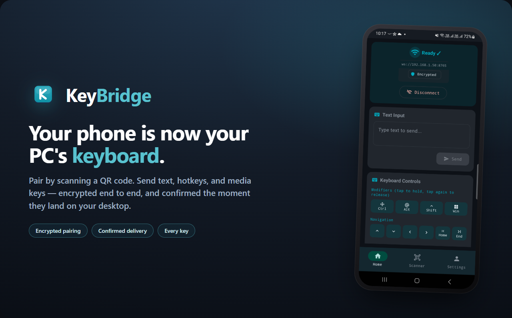
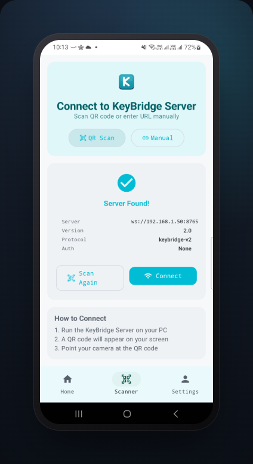
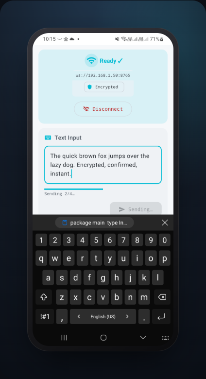
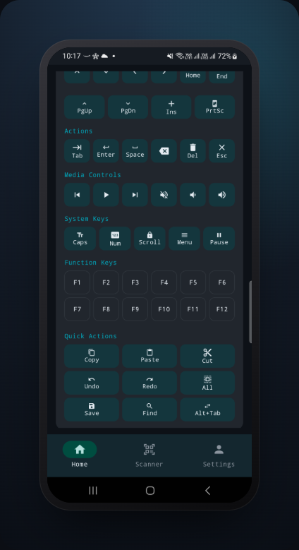
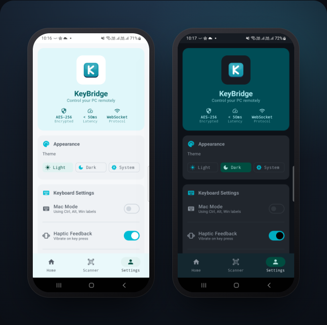

<p align="center">
  
</p>

<p align="center">
  Type on your PC from your phone. Pair by QR, send text, hotkeys, and media keys —
  <br>encrypted end to end, and confirmed the moment they land.
</p>

<p align="center">
  <b>Android client.</b> Needs the desktop host →
  <a href="https://github.com/dog-broad/keybridge-server">keybridge-server</a>
</p>

---

KeyBridge turns your phone into a real input device for your computer. Scan the QR your
desktop shows, and the keystrokes you send are typed on the PC as if they came from a
keyboard plugged into it — full text, modifier combos, function keys, and media controls.

It's built around one rule: **input you send is never assumed delivered.** The phone holds
your text until the host acknowledges it, shows progress while long pastes stream across,
and surfaces failure instead of pretending a dropped message went through.

## How it works

<table>
<tr>
  <td width="33%" valign="top"></td>
  <td width="33%" valign="top"></td>
  <td width="33%" valign="top"></td>
</tr>
<tr>
  <td valign="top"><b>1 · Pair</b><br>Point the camera at the host's QR. The connection is set up from what's in the code — nothing is typed in by hand.</td>
  <td valign="top"><b>2 · Send</b><br>Type and send. Long text streams in chunks with a live progress bar; the field clears only once the host confirms it.</td>
  <td valign="top"><b>3 · Control</b><br>Modifiers, navigation, actions, media keys, F1–F12, and one-tap hotkeys like Copy, Paste, and Alt+Tab.</td>
</tr>
</table>

## Why it's built differently

- **Confirmed delivery, not fire-and-forget.** Every message is acknowledged by the host
  per chunk. The app shows `sending → delivered → failed` as a real state — your text is
  retained and the failure is shown if a send drops, never silently cleared.
- **Pairing with no shared secret in the app.** The key lives only in the QR. Scanning it
  is what authorizes the session; there is no password baked into the build and nothing
  sensitive crosses the network during the handshake.
- **Encrypted per session.** After pairing, every message is AES-256-GCM encrypted under a
  key unique to that connection. A message that doesn't authenticate is rejected — there is
  no plaintext fallback.

## Quick start

1. Install and run **[keybridge-server](https://github.com/dog-broad/keybridge-server)** on your computer — it shows a QR code.
2. Open KeyBridge, go to **Scanner**, and point the camera at that QR (or enter the `ws://` URL by hand).
3. Tap **Connect**. Once the status reads **Ready**, type in the text box or use the key grid — it lands on your PC.

Phone and PC must be on the same Wi-Fi network.

## Yours, light or dark

<p align="center">
  
</p>

Light, dark, or follow the system — the choice persists across launches. Typing delay, key
repeat rate, haptics, Mac-style modifier labels, and auto-connect are all adjustable, and
every control is reachable by screen reader; animations honor the system "remove animations"
setting.

## Built with

Kotlin · Jetpack Compose · Material 3 · MVVM with `StateFlow` · CameraX + ML Kit (QR) · DataStore. Minimum Android 7.0 (API 24).

## Protocol

Input travels in a small versioned envelope, and the host acknowledges every chunk it
applies — which is how the app shows confirmed delivery and tracks progress. A `type`
message looks like:

```json
{ "v": 1, "id": "…", "seq": 0, "total": 1, "type": "type",
  "payload": { "text": "Hello, world" } }
```

The full contract — envelope fields, input types, the acknowledgement shape, chunking, and
bounded idempotent retry — is in **[PROTOCOL.md](PROTOCOL.md)**.

<details>
<summary><b>Supported keys</b></summary>

| Category | Keys |
|----------|------|
| Modifiers | `ctrl`, `alt`, `shift`, `cmd` |
| Navigation | `up`, `down`, `left`, `right`, `home`, `end`, `page_up`, `page_down` |
| Actions | `tab`, `enter`, `space`, `backspace`, `delete`, `esc`, `insert` |
| Function | `f1` – `f12` |
| System | `caps_lock`, `num_lock`, `scroll_lock`, `menu`, `pause`, `print_screen` |
| Media | `media_play_pause`, `media_next`, `media_previous`, `media_volume_up`, `media_volume_down`, `media_volume_mute` |

</details>

## License

[Apache License 2.0](LICENSE).
